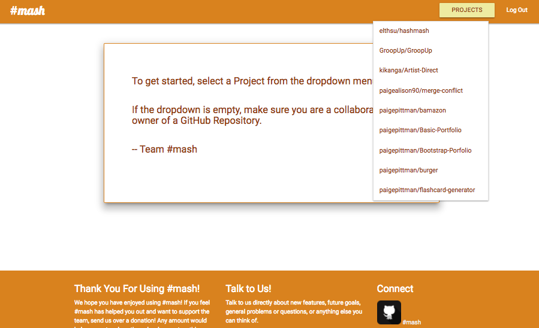
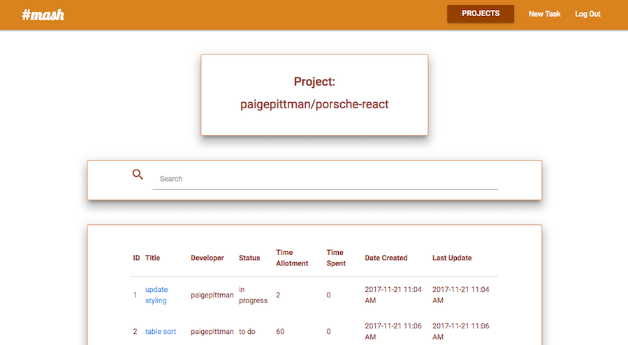
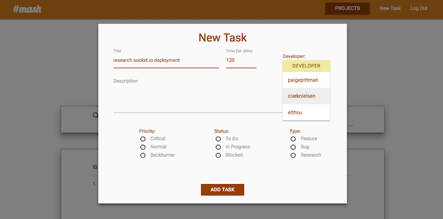
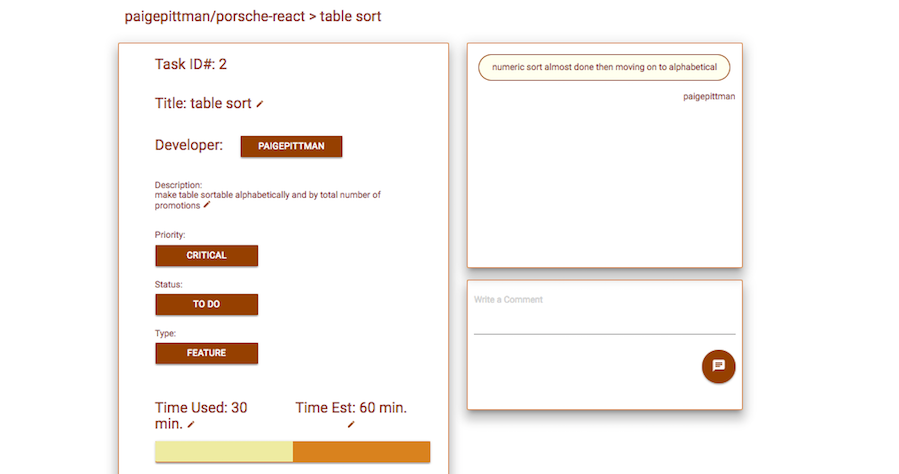

# #mash
Streamlined project management based on your GitHub repos built with React and Socket.io for realtime updates

### GitHub Authentication

students log in with GitHub to get access to their personal repositories as well as repos they are collaborators for

### Viewing all tasks

after selecting a project from the drop down, students are shown all tasks associated with that project (sortable by each column)

### New task modal

students can create new tasks for the project from the nav bar and assign it to a collaborator

### View and update a task

when viewing a specific task, students are able to easily update any information in the task and communicate with their team in the chat box

## Built With

* [React](https://facebook.github.io/react/) - The web framework used
* [MongoDB](https://www.mongodb.com/) - For database
* [Materialize](https://getmdl.io/) - CSS framework
* [socket.io](https://socket.io/) - for realtime updates

## Authors
* **Clark Nielsen** - [clarknielsen](https://github.com/clarknielsen)
* **Elton Hsu** - [elthsu](https://github.com/elthsu)
* **Paige Pittman** - [paigepittman](https://github.com/paigepittman)

## Contact Us
* [Gitter](https://gitter.im/hash-mash/Lobby)
